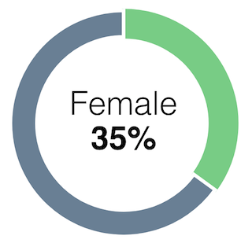

# js-charts

js-charts is a YouScience JavaScript library that allows developers to easily add charts to web apps.

## Getting Started

Install package dependencies.

```
npm install
```

Build the project. Output distribution file path is `./dist/jsc.js`.

```
npm run build
```

Run unit tests.

```
npm test
```

## External Dependencies

Running js-charts on your site requires D3.js 3.3.x.

## Usage

Charts are instantiated using the `JSC` constructor which accepts one argument `options` (object). Options are described below.

| Name         | Description               |
|--------------|---------------------------|
| `type`       | (string) Chart type.      |
| `target`     | (string) Target selector. |

### Basic Example

```javascript
// Instantiate a chart object.
var chart = new JSC({
  type: 'donut',
  target: '#chart',

  ... chart options ...

});

// Create the chart with data.
chart.create([ ... ]);
```

## API

| Method       | Description                                                                                                                    |
|--------------|--------------------------------------------------------------------------------------------------------------------------------|
| `.create(a)` | Creates the SVG element and appends it to the target element. Takes one argument, [`data`](#user-content-data-format) (array). |
| `.render(a)` | Destroys and creates the chart element. Takes one argument, [`data`](#user-content-data-format) (array).                       |
| `.slices()`  | Returns an array containing slice info like index, coordinates, and data sample.                                               |

## Chart Types

| Name     | Description                                        |
|----------|----------------------------------------------------|
| `donut`  | Doughnut chart (see [Donut](#user-content-donut)). |

### Donut

A doughnut chart (or "donut" chart) is essentially a pie chart with the center area removed. Use a Donut chart to express data in a way that does not focus of its size.

#### Chart Options

| Name               | Description                                         |
|--------------------|-----------------------------------------------------|
| `backgroundColor`  | (string) Hex color to use for SVG background color. |
| `colors`           | (array) Array of hex colors for slices.             |
| `fontColor`        | (string) Hex color to use for label font color.     |
| `fontSize`         | (number) Text font size in pixels.                  |
| `lineHeight`       | (number) Text line height in pixels.                |
| `size`             | (number) Size of chart to render in pixels.         |

#### Data Format

Donut chart data items have two key-value pairs, `name` (string) and `percent` (number).

```javascript
[
  {
    name: 'Female',
    percent: 35
  },
  ...
]
```

#### CSS Selectors

| Selector              | Description                                                              |
|-----------------------|--------------------------------------------------------------------------|
| `.jsc-donut`          | SVG element.                                                             |
| `.jsc-slice`          | All slice areas.                                                         |
| `.jsc-slice--{index}` | Slice area by its corresponding data point's index in the data series.   |
| `.jsc-text`           | All text elements.                                                       |
| `.jsc-text--{index}`  | Text elements by its corresponding data point's index in the data series.|
| `.jsc-text--name`     | Text element for data point name.                                        |
| `.jsc-text--percent`  | Text element for data point percent.                                     |

#### Full Example

```html
<style>
.jsc-text {
  font-family: "museo-sans-rounded", "Open Sans", sans-serif;
}
.jsc-text--percent {
  font-weight: bold;
}
</style>

<div id="chart"></div>

<script>
var chart = new JSC({
  type: 'donut',
  target: '#chart',
  colors: ['#78CC85', '#697F94']
});

chart.create([
  {
    name: 'Female',
    percent: 35
  },
  {
    name: 'Male',
    percent: 65
  }
]);
</script>
```


